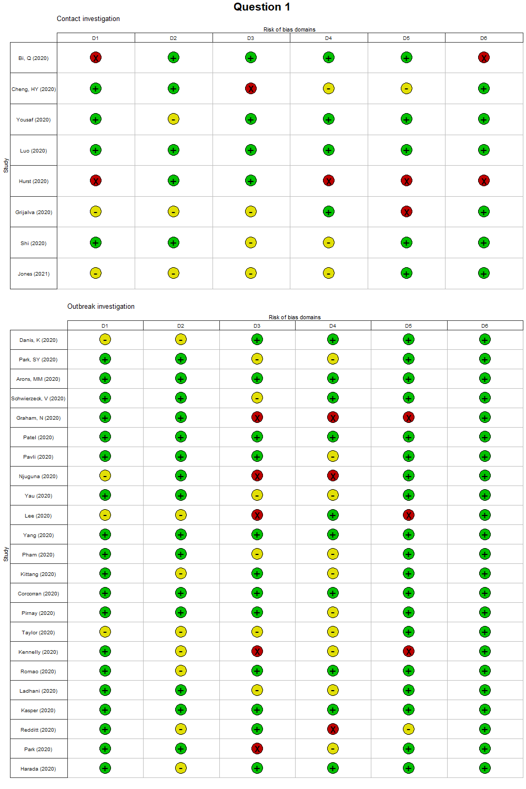
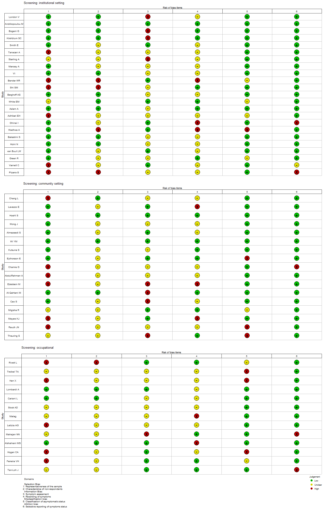

```{r setup, include=FALSE}
knitr::opts_chunk$set(echo = TRUE)

###############################################################
# Supplementary material                        ##########
###############################################################

###############################################################
# Question 1: results output                         ##########
# Proportion of asymptomatic cases                   ##########
# Supplementary material: preprints removed          ##########
###############################################################

#load the libraries
library(meta)
library(readxl)
library(tidyverse)
library(httr) # use to retrieve data from REDCap
library(kableExtra)
library(flextable)
library(dplyr)
library(Rcpp)


# Prepare the data
# get the data directly from redcap:
# report #155 is Q1:
url <- "https://redcap.ispm.unibe.ch/api/"
token <- "F2725F15FE84D2832E2793BB23B0A62B"
formData <- list("token"=token,
                 content='report',
                 format='csv',
                 report_id='155',
                 csvDelimiter='',
                 rawOrLabel='raw',
                 rawOrLabelHeaders='raw',
                 exportCheckboxLabel='false',
                 returnFormat='csv'
)
response <- httr::POST(url, body = formData, encode = "form")
asymptomaticQ1_pub <- httr::content(response)


settings=c("Contact investigation",
           "Contact investigation, aggregated",
           "Outbreak investigation",
           "Statistical model",
           "Screening",
           "Hospitalised adults",
           "Hospitalised children",
           "Hospitalised adults & children")


asymptomaticQ1_pub$setting2<-factor(asymptomaticQ1_pub$setting2, levels=1:8, labels=settings)
#combine contact investigation and contact investigation aggregated
asymptomaticQ1_pub$setting2[asymptomaticQ1_pub$setting2 == "Contact investigation, aggregated"] <- "Contact investigation"

# minor cleaning
asymptomaticQ1_pub[asymptomaticQ1_pub==9999]=NA

asymptomaticQ1_pub$setting=asymptomaticQ1_pub$setting2

#remove preprints at time of search
asymptomaticQ1_pub <- asymptomaticQ1_pub %>%
  filter(source != 1 & source != 2)

data_long1_pub <- gather(asymptomaticQ1_pub, cluster, total, c(q1_c1_total,q1_c2_total,q1_c3_total), factor_key=TRUE) %>% 
  mutate(id=1:nrow(.)) %>%
  select(record_id, author_1, setting, total, id, cluster)
data_long2_pub <-gather(asymptomaticQ1_pub, cluster, events, c(q1_c1_event,q1_c2_event,q1_c3_event), factor_key=TRUE) %>% 
  mutate(id=1:nrow(.)) %>%
  select(events, id)

data_Q1_pub = merge(data_long1_pub, data_long2_pub, by="id")
data_Q1_pub = data_Q1_pub[!is.na(data_Q1_pub$total),]
data_Q1_pub$cluster=factor(data_Q1_pub$cluster,labels=c("1","2","3"),levels=c("q1_c1_total","q1_c2_total","q1_c3_total"))

data_Q1_pub[data_Q1_pub$record_id %in% asymptomaticQ1_pub[is.na(asymptomaticQ1_pub$q1_c2_event),]$record_id,]$cluster=NA

asymptomaticQ1_pub=data_Q1_pub

asymptomaticQ1_pub$label=paste0("#", asymptomaticQ1_pub$record_id, " ", asymptomaticQ1_pub$author_1, " (2020)",ifelse(!is.na(asymptomaticQ1_pub$cluster),paste0(" cluster:",asymptomaticQ1_pub$cluster),"")) # [FU: ",asymptomaticQ1$fup_median,"]")

asymptomaticQ1_pub$label=paste0("#", asymptomaticQ1_pub$record_id, " ", asymptomaticQ1_pub$author_1,ifelse(!is.na(asymptomaticQ1_pub$cluster),paste0(" [cluster:",asymptomaticQ1_pub$cluster,"]"),"")) # [FU: ",asymptomaticQ1$fup_median,"]")

#change clusters to descriptions
asymptomaticQ1_pub$label[asymptomaticQ1_pub$label == "#4479 Harada [cluster:1]"] <- "#4479 Harada [Patients]"
asymptomaticQ1_pub$label[asymptomaticQ1_pub$label == "#4479 Harada [cluster:2]"] <- "#4479 Harada [Healthcare workers]"
#asymptomaticQ1$label[asymptomaticQ1$label == "#2826 Taylor [cluster:1]"] <- "#2826 Taylor []" #clarify
#asymptomaticQ1$label[asymptomaticQ1$label == "#2826 Taylor [cluster:2]"] <- "#2826 Taylor []"
asymptomaticQ1_pub$label[asymptomaticQ1_pub$label == "#2892 Kennelly [cluster:1]"] <- "#2892 Kennelly [Nursing home residents]"
asymptomaticQ1_pub$label[asymptomaticQ1_pub$label == "#2892 Kennelly [cluster:2]"] <- "#2892 Kennelly [Nursing home staff]"
asymptomaticQ1_pub$label[asymptomaticQ1_pub$label == "#2802 Bender [cluster:1]"] <- "#2802 Bender [Hospital 1]"
asymptomaticQ1_pub$label[asymptomaticQ1_pub$label == "#2802 Bender [cluster:2]"] <- "#2802 Bender [Hospital 2]"
asymptomaticQ1_pub$label[asymptomaticQ1_pub$label == "#4968 van Buul [cluster:1]"] <- "#4968 van Buul [Nursing home residents]"
asymptomaticQ1_pub$label[asymptomaticQ1_pub$label == "#4968 van Buul [cluster:2]"] <- "#4968 van Buul [Healthcare workers]"
asymptomaticQ1_pub$label[asymptomaticQ1_pub$label == "#5273 Theuring [cluster:1]"] <- "#5273 Theuring [School students and staff]"
asymptomaticQ1_pub$label[asymptomaticQ1_pub$label == "#5273 Theuring [cluster:2]"] <- "#5273 Theuring [Household members]"


data_pub=asymptomaticQ1_pub[order(asymptomaticQ1_pub$setting,1/(1/asymptomaticQ1_pub$events+1/(asymptomaticQ1_pub$total-asymptomaticQ1_pub$events))),]

data_pub[is.na(data_pub$setting),]$record_id
data_pub=data_pub[!is.na(data_pub$setting),]

asym_plot<-metaprop(events,total,data=data_pub,sm = "PLOGIT", studlab=label, 
                    byvar=setting,# tau.common =TRUE,
                    prediction = TRUE,
                    control=list(stepadj=0.05, maxiter=10000))#, method ="INV") #, verbose=TRUE, digits=5, control=list(stepadj=0.5))

asym_plot

png(file = 'forest_meta_Q1_published.png',width = 30,height = 60, res=600, units="cm") 

forest(asym_plot,  col.square=data_pub$setting, sortvar = 1/seTE,
       #squaresize = 1/(1/data$events+1/(data$total-data$events)),
       #sortvar = 1/(1/events+1/(total-events)), 
       subgroup=TRUE, 
       just.studlab="left", colgap.studlab="2cm",
       #leftcols = c("label", "setting", "age", "design", "asym_denom"),
       #leftcols=c("studlab", "record_id", "event", "n"),
       xlab = "",just="left",comb.random=TRUE,test.subgroup.random=FALSE,
       comb.fixed=FALSE,test.subgroup.fixed=FALSE, predict=T)#, study.results=TRUE,test.subgroup=TRUE)
dev.off()

###############################################################
# Countries included in Q1                           ##########
###############################################################

library(dplyr)
Q1_table_countries <- httr::content(response)

#censor until 5296 (31 Jan) plus the published versions of preprints
pub_preprints <- c(5565, 6219, 6685, 7030, 7465, 8249, 9442, 9484) #published version of preprints before 31 Jan

Q1_table_countries <- Q1_table_countries %>%
  filter(record_id %in%  pub_preprints | record_id <= 5296)

#clean countries
Q1_table_countries <- Q1_table_countries %>%
  mutate(country = ifelse(country == 10, "Australia", country),
         country = ifelse(country == 11, "Austria", country),
         country = ifelse(country == 15, "Bahrain", country),
         country = ifelse(country == 19, "Belgium", country),
         country = ifelse(country == 27, "Brazil", country),
         country = ifelse(country == 28, "Brunei", country),
         country = ifelse(country == 34, "Canada", country),
         country = ifelse(country == 40, "China", country),
         country = ifelse(country == 41, "Colombia", country),
         country = ifelse(country == 51, "Denmark", country),
         country = ifelse(country == 62, "France", country),
         country = ifelse(country == 63, "French Guyana", country),
         country = ifelse(country == 67, "Germany", country),
         country = ifelse(country == 69, "Greece", country),
         country = ifelse(country == 78, "Iceland", country),
         country = ifelse(country == 79, "India", country),
         country = ifelse(country == 83, "Ireland", country),
         country = ifelse(country == 85, "Italy", country),
         country = ifelse(country == 87, "Japan", country),
         country = ifelse(country == 92, "Kuwait", country),
         country = ifelse(country == 105, "Malaysia", country),
         country = ifelse(country == 121, "Netherlands", country),
         country = ifelse(country == 128, "Norway", country),
         country = ifelse(country == 130, "Pakistan", country),
         country = ifelse(country == 888, "Other", country),
         country = ifelse(country == 138, "Portugal", country),
         country = ifelse(country == 146, "Saudi Arabia", country),
         country = ifelse(country == 157, "South Korea", country),
         country = ifelse(country == 160, "Spain", country),
         country = ifelse(country == 174, "Turkey", country),
         country = ifelse(country == 176, "Uganda", country),
         country = ifelse(country == 180, "United Kingdom", country),
         country = ifelse(country == 181, "United States of America", country),
         country = ifelse(country == 185, "Vietnam", country))

#clean case numbers
#total SARS-CoV-2 n
Q1_table_countries$q1_c1_total[is.na(Q1_table_countries$q1_c1_total)] <- 0
Q1_table_countries$q1_c2_total[is.na(Q1_table_countries$q1_c2_total)] <- 0
Q1_table_countries$q1_c1_event[is.na(Q1_table_countries$q1_c1_event)] <- 0
Q1_table_countries$q1_c2_event[is.na(Q1_table_countries$q1_c2_event)] <- 0

Q1_table_countries$total_SARS_n <- Q1_table_countries$q1_c1_total + Q1_table_countries$q1_c2_total
Q1_table_countries$asymp_SARS_n <- Q1_table_countries$q1_c1_event + Q1_table_countries$q1_c2_event

#remove unnecessary cols
Q1_table_countries <- Q1_table_countries %>%
  select(country, total_SARS_n, asymp_SARS_n)

#group by countries to calculate n, total cases, total asymp cases
Q1_table_countries <- Q1_table_countries %>%
  group_by(country) %>%
  summarise(total_SARS = sum(total_SARS_n),
            total_asymp_SARS = sum(asymp_SARS_n),
            n = n())

#arrange by number of studies
Q1_table_countries <- Q1_table_countries %>%
  arrange(desc(n))
#create PRISMA 2020 flowchart

#download packages
library(devtools)
library(dplyr)
#install_github("nealhaddaway/PRISMA2020")

#create df from example csv file
#PRISMA <- read.csv("PRISMA.csv")

#set the REDCap IDs
#last REDCap ID in previous version
#last_ID_prev <- 1000
#last REDCap ID in current version
#last_ID_current <- 5296
#load all records in redcap

# get the data directly from redcap:
# url <- "https://redcap.ispm.unibe.ch/api/"
# token <- "F2725F15FE84D2832E2793BB23B0A62B"
# formData <- list("token"=token,
#                  content='report',
#                  format='csv',
#                  report_id='158',
#                  csvDelimiter='',
#                  rawOrLabel='raw',
#                  rawOrLabelHeaders='raw',
#                  exportCheckboxLabel='false',
#                  returnFormat='csv'
# )
# response_all <- httr::POST(url, body = formData, encode = "form")
# all_records <- httr::content(response_all)
# 
# #find number of studies identified in databases since previous update
# current_records <- all_records[last_ID_prev:last_ID_current, ]
# PRISMA$n[PRISMA$data == "database_results"] <- nrow(current_records[!is.na(current_records$record_id), ]) - 1 #1 was added manually 9484
# 
# #find number included in review
# PRISMA$n[PRISMA$data == "new_studies"] <- nrow(current_records %>% filter(review == 1))
# 
# #find number of duplicates removed before screening
# PRISMA$n[PRISMA$data == "duplicates"] <- nrow(current_records %>% filter(ex_reas == 14))
# #find number of records screening
# PRISMA$n[PRISMA$data == "records_screened"] <- nrow(current_records) - 
#   nrow(current_records %>% filter(ex_reas == 14))
# #add number of studies found via other methods 
# #1 study #9484 was added manually - it's the published v of a preprint
# #as a result, I need to minus 1 record from the database result
# PRISMA$n[PRISMA$box == "othstud"] <- 1
# 
# #find number of records excluded from title and abstract
# PRISMA$n[PRISMA$data == "records_excluded"] <- nrow(current_records %>% filter(ex_reas == 1))
# check <- current_records %>% filter(ex_reas == 1)
# #current records left after title and abstract screening
# full_text_screen <- current_records %>% filter(ex_reas != 14 & ex_reas != 1)
# 
# #find number of full texts retrieved
# PRISMA$n[PRISMA$data == "dbr_sought_reports"] <- nrow(current_records) - 
#   (nrow(current_records %>% filter(ex_reas == 14)) + 
#   nrow(current_records %>% filter(ex_reas == 1)))
# 
# #find number of full texts screened
# PRISMA$n[PRISMA$data == "dbr_assessed"] <- nrow(current_records) - 
#   (nrow(current_records %>% filter(ex_reas == 14)) + 
#      nrow(current_records %>% filter(ex_reas == 1)))
# 
# #find number included in previous version
# prev_records <- all_records[1:last_ID_prev, ]
# PRISMA$n[PRISMA$data == "previous_studies"] <- nrow(prev_records[prev_records$review == 1, ])
# 
# #calculate total studies included
# PRISMA$n[PRISMA$data == "total_studies"] <- nrow(prev_records[prev_records$review == 1, ]) +
#   nrow(current_records[current_records$review == 1, ])
# 
# # studies excluded
# excl_11 <-  nrow(current_records %>% filter(ex_reas == 11))
# excl_12 <-  nrow(current_records %>% filter(ex_reas == 12))
# excl_13 <-  nrow(current_records %>% filter(ex_reas == 13))
# excl_15 <-  nrow(current_records %>% filter(ex_reas == 15))
# excl_16 <-  nrow(current_records %>% filter(ex_reas == 16))
# excl_17 <-  nrow(current_records %>% filter(ex_reas == 17))
# excl_19 <-  nrow(current_records %>% filter(ex_reas == 19))
# excl_20 <-  nrow(current_records %>% filter(ex_reas == 20))
# excl_21 <-  nrow(current_records %>% filter(ex_reas == 21))
# excl_18 <-  nrow(current_records %>% filter(ex_reas == 18))
# 
# excl_reasons <- paste0("Publication not on COVID-19, ", excl_11, 
#                        "; No original data, ", excl_12, 
#                        "; Data included in other publication, ", excl_13, 
#                        "; Insufficient extractable data, ", excl_15, 
#                        "; Study design inappropriate, ", excl_16, 
#                        "; No PCR/serological test, ", excl_17, 
#                        "; Math. model not in review scope, ", excl_19, 
#                        "; Inadequate follow-up time, ", excl_20, 
#                        "; Preprint of published article, ", excl_21, 
#                        "; Other, ", excl_18)
# excl_reasons
# PRISMA$n[PRISMA$data == "dbr_excluded"] <- excl_reasons
# 
# #fix some text in the flowchart data
# PRISMA$boxtext[PRISMA$data == "identification"] <- "Identification"
# PRISMA$boxtext[PRISMA$box == "prevstud"] <- "Previous studies"
# 
#   
# #read data
# flowchart <- PRISMA2020::PRISMA_data(PRISMA)
# flowchart
# #generate flowchart
# PRISMA2020::PRISMA_flowdiagram(data = flowchart, other = FALSE)
# flowchart_plot <- PRISMA2020::PRISMA_flowdiagram(data = flowchart, other = FALSE)
#                                
# PRISMA2020::PRISMA_save(flowchart_plot, filename = "PRISMA2020_flowdiagram.png", filetype = "png", overwrite = TRUE)                               


#######ROB Analysis HI##########

library(dplyr)
#install.packages("ggpubr")
library("ggpubr")

#use the package as a new source. Some functions of the package are changed by HI
source("robisfunctions.R")

# get the data directly from redcap:
urlrob <- "https://redcap.ispm.unibe.ch/api/"
tokenrob <- "F2725F15FE84D2832E2793BB23B0A62B"
formDatarob <- list("token"=tokenrob,
                 content='report',
                 format='csv',
                 report_id='283',
                 csvDelimiter='',
                 rawOrLabel='raw',
                 rawOrLabelHeaders='raw',
                 exportCheckboxLabel='false',
                 returnFormat='csv'
)
response_rob <- httr::POST(urlrob, body = formDatarob, encode = "form")
rob_records <- httr::content(response_rob)

# rob_records$authoryear <- paste0(rob_records$author_1, " (", rob_records$year, ")")

#censor until 5296 (31 Jan) plus the published versions of preprints
pub_preprints <- c(5565, 6219, 6685, 7030, 7465, 8249, 9442, 9484) #published version of preprints before 31 Jan
rob_records <- rob_records %>%
  filter(record_id %in%  pub_preprints | record_id <= 5296)

#prepare a dataset
# df_rob <- rob_records %>%
#   select(record_id,author_1, authoryear, quest___1, q3_sar, setting2, 
#          rob_1, rob_2, rob_3, rob_4, rob_5, rob_6, 
#          risk_of_bias_update_3_complete)

df_rob <- rob_records %>%
  select(record_id,author_1, quest___1, q3_sar, setting2, 
         rob_1, rob_2, rob_3, rob_4, rob_5, rob_6, 
         risk_of_bias_update_3_complete)
df_rob['setting'] <- NA


df_rob <- df_rob %>%
  mutate(setting = ifelse(setting2 == 1, "Contact investigation", setting),
         setting = ifelse(setting2 == 2, "Contact investigation, aggregated", setting),
         setting = ifelse(setting2 == 3, "Outbreak investigation", setting),
         setting = ifelse(setting2 == 4, "Statistical model", setting),
         setting = ifelse(setting2 == 5, "Screening", setting),
         setting = ifelse(setting2 == 6, "Hospitalised adults", setting),
         setting = ifelse(setting2 == 7, "Hospitalised children", setting),
         setting = ifelse(setting2 == 8, "Hospitalised children and adults", setting),
         setting = ifelse(setting2 == 9, "Screening: institutional setting", setting),
         setting = ifelse(setting2 == 10, "Screening: community setting", setting),
         setting = ifelse(setting2 == 11, "Screening: occupational", setting))

#Filtered by Q1
q1_rob <- df_rob %>%
  filter(!is.na(rob_1)) %>%
  filter(record_id != 122) %>%
  filter(quest___1 == 1)  %>%
  select(author_1, rob_1, rob_2, rob_3, rob_4, rob_5, rob_6, record_id, quest___1, q3_sar, setting) %>%
  rename(Study = author_1, D1 = rob_1, D2 = rob_2, D3 = rob_3, D4 = rob_4,
         D5 = rob_5, `6` = rob_6)

q1_rob$D1 <- ifelse(q1_rob$D1 == 1, "High", ifelse(q1_rob$D1 == 2, "Unclear", "Low"))
q1_rob$D2 <- ifelse(q1_rob$D2 == 1, "High", ifelse(q1_rob$D2 == 2, "Unclear", "Low"))
q1_rob$D3 <- ifelse(q1_rob$D3 == 1, "High", ifelse(q1_rob$D3 == 2, "Unclear", "Low"))
q1_rob$D4 <- ifelse(q1_rob$D4 == 1, "High", ifelse(q1_rob$D4 == 2, "Unclear", "Low"))
q1_rob$D5 <- ifelse(q1_rob$D5 == 1, "High", ifelse(q1_rob$D5 == 2, "Unclear", "Low"))
q1_rob$`6` <- ifelse(q1_rob$`6` == 1, "High", ifelse(q1_rob$`6` == 2, "Unclear", "Low"))

####Plots filtered by settings#########

#1. "Contact investigation" and "Contact investigation, aggregated"
contactinvestigation <- q1_rob %>% 
  filter(setting == "Contact investigation" | setting == "Contact investigation, aggregated") %>%
  select(Study, D1, D2, D3, D4, D5, `6`)

contactinvestigation_rob_trafficlight <- rob_traffic_light(data = contactinvestigation,
                                         tool = "Generic",
                                         psize = 10,
                                         overall = FALSE)

p1 <- contactinvestigation_rob_trafficlight +
  ggplot2::labs(
    caption = " ") + 
  ggplot2::ggtitle("Contact investigation") +
  ggplot2::theme(legend.position = "none")


# 3. "Outbreak investigation"
outbreakinv <- q1_rob %>% 
  filter(setting == "Outbreak investigation") %>%
  select(Study, D1, D2, D3, D4, D5, `6`)

outbreakinv_rob_trafficlight <- rob_traffic_light(data = outbreakinv,
                                                           tool = "Generic",
                                                           psize = 10,
                                                           overall = FALSE)
p2 <- outbreakinv_rob_trafficlight +
  ggplot2::labs(
    caption = " ") + 
  ggplot2::ggtitle("Outbreak investigation") +
  ggplot2::theme(legend.position = "none")

p3 <- ggarrange(p1,p2,heights = c(1, 1.7), ncol = 1, nrow = 2)

p3 <- annotate_figure(p3, top = text_grob("Question 1", 
                                      color = "black", face = "bold", size = 21))


dev.new()
png("q1_1_new.png", width = 1000, height = 1500)
p3
graphics.off()


# 9. "Screening: institutional setting"
institutional <- q1_rob %>% 
  filter(setting == "Screening: institutional setting") %>%
  select(Study, D1, D2, D3, D4, D5, `6`)
#Records: 21 studies

institutional_rob_trafficlight <- rob_traffic_light(data = institutional,
                                                    tool = "Generic",
                                                    psize = 10,
                                                    overall = FALSE)
p4 <- institutional_rob_trafficlight +
  ggplot2::labs(
    caption = " ") + 
  ggplot2::ggtitle("Screening: institutional setting") +
  ggplot2::theme(legend.position = "none")

# 10. "Screening: community setting"
communityset <- q1_rob %>% 
  filter(setting == "Screening: community setting") %>%
  select(Study, D1, D2, D3, D4, D5, `6`)
#Records: 17 studies

communityset_rob_trafficlight <- rob_traffic_light(data = communityset,
                                                   tool = "Generic",
                                                   psize = 10,
                                                   overall = FALSE)

p5 <- communityset_rob_trafficlight +
  ggplot2::labs(
    caption = " ") + 
  ggplot2::ggtitle("Screening: community setting") +
  ggplot2::theme(legend.position = "none")


# 11. "Screening: occupational"
occupationalset <- q1_rob %>% 
  filter(setting == "Screening: occupational") %>%
  select(Study, D1, D2, D3, D4, D5, `6`)
#Records: 12 studies

occupationalset_rob_trafficlight <- rob_traffic_light(data = occupationalset,
                                                      tool = "Generic",
                                                      psize = 10,
                                                      overall = FALSE)


p6 <- occupationalset_rob_trafficlight +
  ggplot2::labs(
    caption = "
    Domains

    Selection Bias:
  1: Representativeness of the sample
  2: Characteristics of non-respondents
    Information Bias:
  3: Symptom assessment
  4: Recording of symptoms
    Misclassification bias:
  5: Classification of asymptomatic status
    Attrition bias:
  6: Selective reporting of symptoms status")

p6 <- p6 + 
  ggplot2::ggtitle("Screening: occupational")


p7 <- ggarrange(p4,p5,p6, heights = c(1.1, 1, 1), ncol = 1, nrow = 3)

dev.new()
png("q1_2_new.png", width = 1000, height = 2900)
p7
graphics.off()

###ROB analysis for Q2.1
q2_rob <- df_rob %>%
  filter(q3_sar == 1)  %>%
  select(author_1, rob_1, rob_2, rob_3, rob_4, rob_5, rob_6) %>%
  rename(Study = author_1, D1 = rob_1, D2 = rob_2, D3 = rob_3, D4 = rob_4,
         D5 = rob_5, `6` = rob_6)

q2_rob$D1 <- ifelse(q2_rob$D1 == 1, "High", ifelse(q2_rob$D1 == 2, "Unclear", "Low"))
q2_rob$D2 <- ifelse(q2_rob$D2 == 1, "High", ifelse(q2_rob$D2 == 2, "Unclear", "Low"))
q2_rob$D3 <- ifelse(q2_rob$D3 == 1, "High", ifelse(q2_rob$D3 == 2, "Unclear", "Low"))
q2_rob$D4 <- ifelse(q2_rob$D4 == 1, "High", ifelse(q2_rob$D4 == 2, "Unclear", "Low"))
q2_rob$D5 <- ifelse(q2_rob$D5 == 1, "High", ifelse(q2_rob$D5 == 2, "Unclear", "Low"))
q2_rob$`6` <- ifelse(q2_rob$`6` == 1, "High", ifelse(q2_rob$`6` == 2, "Unclear", "Low"))

q2_plot_ds <- q2_rob %>% 
  select(Study, D1, D2, D3, D4, D5, `6`)

q2_rob_trafficlight <- rob_traffic_light(data = q2_plot_ds,
                                                    tool = "Generic",
                                                    psize = 10,
                                                    overall = FALSE)


p8 <- q2_rob_trafficlight +
  ggplot2::labs(
    caption = "
    Domains

    Selection Bias:
  1: Representativeness of the sample
  2: Characteristics of non-respondents
    Information Bias:
  3: Symptom assessment
  4: Recording of symptoms
    Misclassification bias:
  5: Classification of asymptomatic status
    Attrition bias:
  6: Selective reporting of symptoms status")

p8 <- p8 + 
  ggplot2::ggtitle("Question 2.1") +
  theme(plot.title = element_text(hjust = 0.5)) + theme(plot.title = element_text(size = 16, face = "bold"))

dev.new()
png("q2_new.png", width = 1400, height = 500)
p8
graphics.off()


```

## PRISMA 2020 Checklist
*Shiny app can be used to complete checklist here:* <https://prisma.shinyapps.io/checklist/>

***

## Search strings

From: Living Evidence on COVID-19 (<https://ispmbern.github.io/covid-19/living-review/collectingdata.html>, accessed 31.01.2021)

We retrieve data from [EMBASE](http://www.embase.com/) via OVID, [MEDLINE](https://www.ncbi.nlm.nih.gov/pubmed/) via PubMed, BioRxiv and MedRxiv.

**Search terms**

When searches are updated, references that are identified that were not in the database before, are inserted by date (**date_entrez**) they were indexed in remote database, the date they are inserted in OUR database is formatted as the ‘**strategydate**’ (raw data is available [here](https://github.com/leonieheron/LSRworkflow>)).

**30.10.2020**

EMBASE:

(exp SARS-related coronavirus/ or severe acute respiratory syndrome/ or coronavirus disease 2019/ or (coronavir* or corona virus* or HCoV* or ncov* or 2019 cov or covid or covid19 or sars-cov* or sarscov* or sars-coronavirus* or Severe Acute Respiratory Syndrome Coronavirus* or nCoV).mp.) and 20191101:20301231.(dc).

MEDLINE:

("severe acute respiratory syndrome coronavirus 2"[Supplementary Concept] OR "COVID-19" [Supplementary Concept] OR "coronavirus" OR "corona virus" OR "HCoV" OR "nCoV" OR "2019 CoV" OR "covid" OR "covid19" OR "Severe Acute Respiratory Syndrome Coronavirus 2" OR "SARS-CoV2" OR "SARS-CoV 2" OR "SARS Coronavirus 2") AND (2019/11/01:3000/12/31[PDAT])

**01.05.2021**

EMBASE:

(SARS coronavirus/ or middle east respiratory syndrome/ or severe acute respiratory syndrome/ or (coronavirus* or corona virus* or HCoV* or ncov* or covid or covid19 or sars-cov* or sarscov* or Sars-coronavirus* or Severe Acute Respiratory Syndrome Coronavirus*).mp.) and 20191201:20301231.(dc).

**29.04.2020**

MEDLINE:

("coronavirus"[MH] OR "coronavirus infections"[MH] OR "coronavirus"[TW] OR "corona virus"[TW] OR "HCoV"[TW] OR "nCov"[TW] OR "covid"[TW] OR "covid19"[TW] OR "Severe Acute Respiratory Syndrome Coronavirus 2"[TW] OR "SARS-CoV2"[TW] OR "SARS-CoV 2"[TW] OR "SARS Coronavirus 2"[TW] OR "MERS- CoV"[TW]) AND (2019/1/1:3000[PDAT])

**01.04.2020**

From 01.04.2020, we retrieve the [BioRxiv/MedRxiv dataset](https://connect.medrxiv.org/relate/content/181).

**26.03.2020**

MEDLINE:

("Wuhan coronavirus" [Supplementary Concept] OR "COVID-19" OR SARS-CoV-2 OR "2019 ncov"[tiab] OR (("novel coronavirus"[tiab] OR "new coronavirus"[tiab]) AND (wuhan[tiab] OR 2019[tiab])) OR 2019-nCoV[All Fields] OR (wuhan[tiab] AND coronavirus[tiab]))

EMBASE:

(nCoV or 2019-nCoV or ((new or novel or wuhan) adj3 coronavirus) or covid19 or covid-19 or SARS-CoV-2).mp.

BioRxiv/MedRxiv:

ncov or corona or wuhan or COVID or SARS-CoV-2
 
With the kind support of the [Public Health & Primary Care Library PHC](https://www.unibe.ch/university/services/university_library/faculty_libraries/medicine/public_health_amp_primary_care_library_phc/index_eng.html), and following guidance of the [Medical Library Association](https://www.mlanet.org/p/cm/ld/fid%3D1713)

**01.01.2020**

MEDLINE:

("Wuhan coronavirus" [Supplementary Concept] OR "COVID-19" OR "2019 ncov"[tiab] OR (("novel coronavirus"[tiab] OR "new coronavirus"[tiab]) AND (wuhan[tiab] OR 2019[tiab])) OR 2019-nCoV[All Fields] OR (wuhan[tiab] AND coronavirus[tiab])))))

EMBASE:

ncov OR (wuhan AND corona) OR COVID

BioRxiv/MedRxiv:

ncov or corona or wuhan or COVID

We retained publications that used the keywords listed below in the title or abstract.

"asymp*" OR "pre-symp*" OR "presymp*" OR "preclinical" OR "pre-clinical" OR "without symptoms" OR "no symptoms" OR "free of symptoms" OR "non-symp*" OR "nonsymp*" OR "symptom-free" OR "symptomfree"

***

## PRISMA 2020 Flowchart
*In progress.*
***

## Risk of bias in studies included in review question 1 and review question 2.





***

## Review question 1, subgroup analysis comparing studies of hospitalised patients with all other settings.
*Sub-group analysis to be decided*

***

## Review question 1, sensitivity analysis, omitting studies that were preprints at the time of literature search.


***

## Assessment of credibility of mathematical modelling studies.
*In progress.*

***

## Types of study included in successive versions of the living systematic review, as of 10 June 2020.
*Settings to be reviewed. Some studies have been reclassified into different settings.*

***

## Location of studies contributing data to review questions 1 and 2.1.

```{r table1, ft.split=TRUE, tab.cap='Table 1. Location of studies contributing data to review questions 1', echo = FALSE}
table1_countries <- flextable(Q1_table_countries)

table1_countries %>% 
  set_header_labels(country = "Country",
                    total_SARS = "Total SARS-CoV-2, n",
                    total_asymp_SARS = "Total asymptomatic SARS-CoV-2, n",
                    n = "Total number of studies") %>%
  set_table_properties(layout = "autofit") %>%
  theme_vanilla()
```

*Table 2 in progress.*


