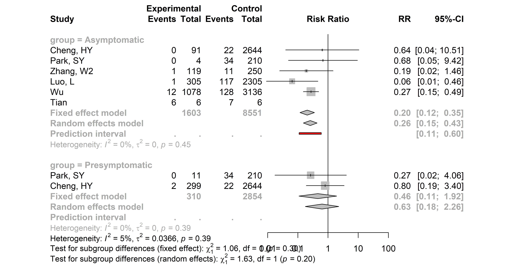

```{r setup, include = FALSE}
knitr::opts_chunk$set(echo = FALSE)

#download packages
library(meta)
library(readxl)
library(tidyverse)
library(httr) # use to retrieve data from REDCap
library(kableExtra)
library(flextable)
library(dplyr)
library(RCurl)
library(tidyr)
library(ggplot2)
library(metafor)


#download data
# get the data directly from redcap:
# report #155 is Q1:
url <- "https://redcap.ispm.unibe.ch/api/"
token <- "F2725F15FE84D2832E2793BB23B0A62B"
formData <- list("token"=token,
                 content='report',
                 format='csv',
                 report_id='155',
                 csvDelimiter='',
                 rawOrLabel='raw',
                 rawOrLabelHeaders='raw',
                 exportCheckboxLabel='false',
                 returnFormat='csv'
)
response <- httr::POST(url, body = formData, encode = "form")

##########################################
# Q1 forest plot
##########################################

asymptomaticQ1 <- httr::content(response)


settings=c("Contact investigation",
           "Contact investigation, aggregated",
           "Outbreak investigation",
           "Statistical model",
           "Screening",
           "Hospitalised adults",
           "Hospitalised children",
           "Hospitalised adults & children",
           "Screening: institutional setting",
           "Screening: community setting",
           "Screening: occupational")


asymptomaticQ1$setting2<-factor(asymptomaticQ1$setting2, levels=1:11, labels=settings)
#combine contact investigation and contact investigation aggregated
asymptomaticQ1$setting2[asymptomaticQ1$setting2 == "Contact investigation, aggregated"] <- "Contact investigation"

# minor cleaning
asymptomaticQ1[asymptomaticQ1==9999]=NA

asymptomaticQ1$setting = asymptomaticQ1$setting2


data_long1 <- gather(asymptomaticQ1, cluster, total, c(q1_c1_total,q1_c2_total,q1_c3_total), factor_key=TRUE) %>% 
  mutate(id=1:nrow(.)) %>%
  select(record_id, author_1, setting, total, id, cluster)
data_long2 <-gather(asymptomaticQ1, cluster, events, c(q1_c1_event,q1_c2_event,q1_c3_event), factor_key=TRUE) %>% 
  mutate(id=1:nrow(.)) %>%
  select(events, id)

data_Q1 = merge(data_long1, data_long2, by="id")
data_Q1 = data_Q1[!is.na(data_Q1$total),]
data_Q1$cluster=factor(data_Q1$cluster,labels=c("1","2","3"),levels=c("q1_c1_total","q1_c2_total","q1_c3_total"))

data_Q1[data_Q1$record_id %in% asymptomaticQ1[is.na(asymptomaticQ1$q1_c2_event),]$record_id,]$cluster=NA

asymptomaticQ1=data_Q1

asymptomaticQ1$label=paste0("#", asymptomaticQ1$record_id, " ", asymptomaticQ1$author_1, " (2020)",ifelse(!is.na(asymptomaticQ1$cluster),paste0(" cluster:",asymptomaticQ1$cluster),"")) # [FU: ",asymptomaticQ1$fup_median,"]")

asymptomaticQ1$label=paste0("#", asymptomaticQ1$record_id, " ", asymptomaticQ1$author_1,ifelse(!is.na(asymptomaticQ1$cluster),paste0(" [cluster:",asymptomaticQ1$cluster,"]"),"")) # [FU: ",asymptomaticQ1$fup_median,"]")

#change clusters to descriptions
asymptomaticQ1$label[asymptomaticQ1$label == "#4479 Harada [cluster:1]"] <- "#4479 Harada [Patients]"
asymptomaticQ1$label[asymptomaticQ1$label == "#4479 Harada [cluster:2]"] <- "#4479 Harada [Healthcare workers]"
#asymptomaticQ1$label[asymptomaticQ1$label == "#2826 Taylor [cluster:1]"] <- "#2826 Taylor []" #clarify
#asymptomaticQ1$label[asymptomaticQ1$label == "#2826 Taylor [cluster:2]"] <- "#2826 Taylor []"
asymptomaticQ1$label[asymptomaticQ1$label == "#2892 Kennelly [cluster:1]"] <- "#2892 Kennelly [Nursing home residents]"
asymptomaticQ1$label[asymptomaticQ1$label == "#2892 Kennelly [cluster:2]"] <- "#2892 Kennelly [Nursing home staff]"
asymptomaticQ1$label[asymptomaticQ1$label == "#4968 van Buul [cluster:1]"] <- "#4968 van Buul [Nursing home residents]"
asymptomaticQ1$label[asymptomaticQ1$label == "#4968 van Buul [cluster:2]"] <- "#4968 van Buul [Healthcare workers]"
asymptomaticQ1$label[asymptomaticQ1$label == "#5273 Theuring [cluster:1]"] <- "#5273 Theuring [School students and staff]"
asymptomaticQ1$label[asymptomaticQ1$label == "#5273 Theuring [cluster:2]"] <- "#5273 Theuring [Household members]"
asymptomaticQ1$label[asymptomaticQ1$label == "#2751 van den Besselaar [cluster:1]"] <- "#2751 van den Besselaar [Healthcare workers]"
asymptomaticQ1$label[asymptomaticQ1$label == "#2751 van den Besselaar [cluster:2]"] <- "#2751 van den Besselaar [Residents]"
asymptomaticQ1$label[asymptomaticQ1$label == "#2826 Taylor [cluster:1]"] <- "#2826 Taylor [Healthcare personnel]"
asymptomaticQ1$label[asymptomaticQ1$label == "#2826 Taylor [cluster:2]"] <- "#2826 Taylor [Residents]"
asymptomaticQ1$label[asymptomaticQ1$label == "#3719 Ladhani [cluster:1]"] <- "#3719 Ladhani [Residents]"
asymptomaticQ1$label[asymptomaticQ1$label == "#3719 Ladhani [cluster:2]"] <- "#3719 Ladhani [Healthcare workers]"
asymptomaticQ1$label[asymptomaticQ1$label == "#5551 Vohra [cluster:1]"] <- "#5551 Vohra [Presurgical patients]"
asymptomaticQ1$label[asymptomaticQ1$label == "#5551 Vohra [cluster:2]"] <- "#5551 Vohra [Undergoing chemotherapy]"
asymptomaticQ1$label[asymptomaticQ1$label == "#6526 Garibaldi [cluster:1]"] <- "#6526 Garibaldi [Residents]"
asymptomaticQ1$label[asymptomaticQ1$label == "#6526 Garibaldi [cluster:2]"] <- "#6526 Garibaldi [Staff]"


data=asymptomaticQ1[order(asymptomaticQ1$setting,1/(1/asymptomaticQ1$events+1/(asymptomaticQ1$total-asymptomaticQ1$events))),]

data[is.na(data$setting),]$record_id
data=data[!is.na(data$setting),]

#cut data at end of jan 31
published_preprints <-c(5565,6219, 6685, 7030, 7465, 8249, 9442, 9484)
data <- data %>%
  filter(record_id <= 5296 | record_id %in% published_preprints)


asym_plot<-metaprop(events,total,data=data,sm = "PLOGIT", studlab=label, 
                    byvar=setting,# tau.common =TRUE,
                    prediction = TRUE,
                    control=list(stepadj=0.05, maxiter=10000))#, method ="INV") #, verbose=TRUE, digits=5, control=list(stepadj=0.5))

asym_plot

png(file = 'forest_meta_Q1.png',width=25,height=80, res=600, units="cm") 

forest(asym_plot,  col.square=data$setting, sortvar = 1/seTE,
       #squaresize = 1/(1/data$events+1/(data$total-data$events)),
       #sortvar = 1/(1/events+1/(total-events)), 
       subgroup=TRUE, 
       just.studlab="left", colgap.studlab="2cm",
       #leftcols = c("label", "setting", "age", "design", "asym_denom"),
       #leftcols=c("studlab", "record_id", "event", "n"),
       xlab = "",just="left",comb.random=TRUE,test.subgroup.random=FALSE,
       comb.fixed=FALSE,test.subgroup.fixed=FALSE, predict=T)#, study.results=TRUE,test.subgroup=TRUE)
dev.off()

#sort by standard error
#read meta book and figure it out
#same as precision plot
pdf(file = 'forest_meta_Q1.pdf', width = 10, height = 30) 

forest(asym_plot,  col.square=data$setting,sortvar = 1/(sqrt(seTE)),
       #squaresize = 1/(1/data$events+1/(data$total-data$events)),
       #sortvar = 1/(1/events+1/(total-events)), 
       subgroup=TRUE, 
       just.studlab="left", colgap.studlab="2cm",
       #leftcols = c("label", "setting", "age", "design", "asym_denom"),
       #leftcols=c("studlab", "record_id", "event", "n"),
       xlab = "",just="left",comb.random=TRUE,test.subgroup.random=FALSE,
       comb.fixed=FALSE,test.subgroup.fixed=FALSE, predict=T)#, study.results=TRUE,test.subgroup=TRUE)
dev.off()


q1_nstudies <- nrow(asym_plot$data) #total number of studies included in q1
q1_nppl <- prettyNum(sum(asymptomaticQ1$total), big.mark = ",") #total number of people included in q1
q1_nasymp <-  prettyNum(sum(asymptomaticQ1$events), big.mark = ",") #number of people asymptomatic included in q1


##########################################
# Q2.1 forest plot
##########################################
  
# get the data directly from redcap: 
# report #172 is Q2.1 SAR:
url <- "https://redcap.ispm.unibe.ch/api/"
token <- "F2725F15FE84D2832E2793BB23B0A62B"
formData2_1 <- list("token"=token,
                    content='report',
                    format='csv',
                    report_id='172',
                    csvDelimiter='',
                    rawOrLabel='raw',
                    rawOrLabelHeaders='raw',
                    exportCheckboxLabel='false',
                    returnFormat='json'
)
response2_1 <- httr::POST(url, body = formData2_1, encode = "form")
asymptomaticQ2_1 <- httr::content(response2_1)

#clean data
asymptomaticQ2_1[asymptomaticQ2_1=="9999;9999"]=NA #indicate as missing
asymptomaticQ2_1[asymptomaticQ2_1=="9999"]=NA #indicate as missing

#added for now
asymptomaticQ2_1 <- asymptomaticQ2_1[asymptomaticQ2_1$record_id < 5296, ]

asymptomaticQ2_1=asymptomaticQ2_1%>% #separate symp SAR into 2 variables
  separate(q3_sar_s, c("Ec","Nc"), ";", remove=FALSE) 
asymptomaticQ2_1=asymptomaticQ2_1%>% #separate asymp SAR into 2 variables
  separate(q3_sar_a, c("Ee_a","Ne_a"), ";", remove=FALSE) 
asymptomaticQ2_1=asymptomaticQ2_1%>% #separate presymp SAR into 2 variables
  separate(q3_sar_p, c("Ee_p","Ne_p"), ";", remove=FALSE) 

asymptomaticQ2_1=asymptomaticQ2_1 %>% #change values to numeric
  mutate(Ec=as.numeric(Ec),
         Nc=as.numeric(Nc),
         Ee_a=as.numeric(Ee_a),
         Ne_a=as.numeric(Ne_a),
         Ee_p=as.numeric(Ee_p),
         Ne_p=as.numeric(Ne_p))

#create new df with asymp/presymp as subgroups
q2_1_df_a <- asymptomaticQ2_1 %>%
  select("record_id", "author_1", "Ee_a", "Ne_a", "Ec", "Nc", "region", "year") %>%
  rename(Ee = Ee_a,
         Ne = Ne_a) %>%
  filter(!is.na(Ee)) %>%
  mutate(group = "Asymptomatic")
q2_1_df_p <- asymptomaticQ2_1 %>%
  select("record_id", "author_1", "Ee_p", "Ne_p", "Ec", "Nc", "region", "year") %>%
  rename(Ee = Ee_p,
         Ne = Ne_p) %>%
  filter(!is.na(Ee)) %>%
  mutate(group = "Presymptomatic")
#bind rows
q2_1_df <- bind_rows(q2_1_df_a, q2_1_df_p)

#cut data at end of jan 31
published_preprints <-c(5565,6219, 6685, 7030, 7465, 8249, 9442, 9484)
q2_1_df <- q2_1_df %>%
  filter(record_id <= 5296 | record_id %in% published_preprints)

#metaanalysis for asymptomatic transmission

q2_1_asymp <- metabin(event.e = Ee,
                      n.e = Ne,
                      event.c = Ec,
                      n.c = Nc, 
                      data = q2_1_df,
                      studlab = author_1,
                      prediction = TRUE,
                      sm = "RR",
                      method = "MH",
                      MH.exact = TRUE, 
                      byvar = group,
                      comb.random = TRUE,
                      comb.fixed = FALSE, 
                      label.e = "",
                      label.c = "Symptomatic")
q2_1_asymp


pdf(file = 'forest_meta_Q2_1.pdf', width = 8, height = 6)

forest(q2_1_asymp, sortvar = (1/(sqrt(seTE))), overall = FALSE,
       overall.hetstat = FALSE,
       leftlabs = c(NA, "      E", "      N", "            E", "        N"))


pdf(file = 'forest_meta_Q2_1.pdf', width = 8, height = 6)

forest(q2_1_asymp, sortvar = (1/(sqrt(seTE))), overall = FALSE,
       overall.hetstat = FALSE,
       leftlabs = c(NA, "      E", "      N", "            E", "        N"))

dev.off()

q2_1_nstudies <- nrow(q2_1_asymp$data) #total number of studies included in q1

##########################################
# supplementary information - by precision
##########################################

#metaanalysis for asymptomatic transmission

q2_1_asymp_precision <- metabin(event.e = Ee,
                                n.e = Ne,
                                event.c = Ec,
                                n.c = Nc, 
                                data = q2_1_df,
                                studlab = author_1,
                                sm = "RR",
                                byvar = group)

png(file = 'forest_meta_Q2_1.png', width = 600, height = 300)

forest(q2_1_asymp, sortvar = (1/(sqrt(seTE))), overall = FALSE,
       overall.hetstat = FALSE,
       leftlabs = c(NA, "      E", "      N", "            E", "        N"))

dev.off()


##########################################
# table on characteristics of Q2.1 studies
##########################################

#table not necessary - all studies in q2.1 described in full table on q1, and numbers are in forest plot

#get data
#Q2_1_table <- httr::content(response2_1)


#clean countries
#Q2_1_table <- Q2_1_table %>%
 # mutate(country = ifelse(country == 10, "Australia", country),
  #       country = ifelse(country == 11, "Austria", country),
  #       country = ifelse(country == 15, "Bahrain", country),
  #       country = ifelse(country == 19, "Belgium", country),
  #       country = ifelse(country == 28, "Brunei", country),
  #       country = ifelse(country == 34, "Canada", country),
  #       country = ifelse(country == 40, "China", country),
  #       country = ifelse(country == 41, "Colombia", country),
  #       country = ifelse(country == 51, "Denmark", country),
  #       country = ifelse(country == 62, "France", country),
  #       country = ifelse(country == 63, "French Guyana", country),
  #       country = ifelse(country == 67, "Germany", country),
  #       country = ifelse(country == 69, "Greece", country),
  #       country = ifelse(country == 78, "Iceland", country),
  #       country = ifelse(country == 79, "India", country),
  #       country = ifelse(country == 83, "Ireland", country),
  #       country = ifelse(country == 85, "Italy", country),
  #       country = ifelse(country == 87, "Japan", country),
  #       country = ifelse(country == 92, "Kuwait", country),
  #       country = ifelse(country == 105, "Malaysia", country),
  #       country = ifelse(country == 121, "Netherlands", country),
  #       country = ifelse(country == 128, "Norway", country),
  #       country = ifelse(country == 888, "Other", country),
  #       country = ifelse(country == 138, "Portugal", country),
  #       country = ifelse(country == 146, "Saudi Arabia", country),
  #       country = ifelse(country == 157, "South Korea", country),
  #       country = ifelse(country == 160, "Spain", country),
  #       country = ifelse(country == 174, "Turkey", country),
  #       country = ifelse(country == 176, "Uganda", country),
  #       country = ifelse(country == 180, "United Kingdom", country),
  #       country = ifelse(country == 181, "United States of America", country),
  #       country = ifelse(country == 185, "Vietnam", country))
#clean regions

#Q2_1_table$region[Q2_1_table$region == "none" | Q2_1_table$region == "None."] <- NA
#create location variable
#Q2_1_table$location <- Q2_1_table$country
#Q2_1_table <- Q2_1_table %>%
#  mutate(location = ifelse(!is.na(region), paste0(country, ", ", region), country))
#drop country and region variables
#Q2_1_table$country <- NULL
#Q2_1_table$region <- NULL

#author column
#Q2_1_table$study <- paste0(Q2_1_table$author_1, " (", Q2_1_table$year, ")")
#Q2_1_table$author_1 <- NULL
#Q2_1_table$record_id <- NULL
#Q2_1_table$year <- NULL


#clean settings
#Q2_1_table$setting <- "Not available"
#Q2_1_table <- Q2_1_table %>%
 # mutate(setting = ifelse(setting2 == 1, "Contact investigation", setting),
#         setting = ifelse(setting2 == 2, "Contact investigation, aggregated", setting),
#         setting = ifelse(setting2 == 3, "Outbreak investigation", setting),
#         setting = ifelse(setting2 == 4, "Statistical model", setting),
#         setting = ifelse(setting2 == 5, "Screening", setting),
#         setting = ifelse(setting2 == 6, "Hospitalised adults", setting),
#         setting = ifelse(setting2 == 7, "Hospitalised children", setting),
#         setting = ifelse(setting2 == 8, "Hospitalised children and adults", setting),
#         setting = ifelse(setting2 == 9, "Screening: hospitalised patients", setting),
#         setting = ifelse(setting2 == 10, "Screening: general population", setting),
#         setting = ifelse(setting2 == 11, "Screening: occupational", setting))
#Q2_1_table$setting2 <- NULL

#reorder columns
#Q2_1_table <- data.frame(Q2_1_table$study,
 #                        Q2_1_table$setting,
#                         Q2_1_table$location)

#names(Q2_1_table) <- c("study", "setting", "location")


###############################################################
# Question 2.2: results output ################################
# Proportion of transmission from asymp or pre-symp ###########
###############################################################

# get the data directly from REDCap: 
# report #157 is Q2.2:

url <- "https://redcap.ispm.unibe.ch/api/"
token <- "F2725F15FE84D2832E2793BB23B0A62B"
formData2_2 <- list("token"=token,
                    content='report',
                    format='csv',
                    report_id='157',
                    csvDelimiter='',
                    rawOrLabel='raw',
                    rawOrLabelHeaders='raw',
                    exportCheckboxLabel='false',
                    returnFormat='csv'
)
response2_2 <- httr::POST(url, body = formData2_2, encode = "form")
asymptomaticQ2_2 <- httr::content(response2_2)

#clean data
asymptomaticQ2_2[asymptomaticQ2_2=="9999;9999"]=NA #indicate as missing
asymptomaticQ2_2[asymptomaticQ2_2 == "9999"] = NA #indicate as missing

#create a separate dataset for the records with >1 result
two_models <- asymptomaticQ2_2
#separate into 2 variables
two_models = two_models %>% 
  separate(q3_pp_m, c("q3_pp_m_1","q3_pp_m_2"), ";")
two_models = two_models %>% 
  separate(q3_pp_l, c("q3_pp_l_1","q3_pp_l_2"), ";") 
two_models = two_models %>%
  separate(q3_pp_u, c("q3_pp_u_1","q3_pp_u_2"), ";")
two_models = two_models %>% 
  separate(q3_setting, c("q3_setting_1","q3_setting_2"), ";") 

two_models <- two_models %>% #change values to numeric
  mutate(q3_pp_m_1=as.numeric(q3_pp_m_1),
         q3_pp_m_2=as.numeric(q3_pp_m_2),
         q3_pp_l_1=as.numeric(q3_pp_l_1),
         q3_pp_l_2=as.numeric(q3_pp_l_2),
         q3_pp_u_1=as.numeric(q3_pp_u_1),
         q3_pp_u_2=as.numeric(q3_pp_u_2))


two_models <- two_models[!is.na(two_models$q3_pp_m_2),]

substrRight <- function(x, n){
  substr(x, nchar(x)-n+1, nchar(x))
}

L1 <- two_models %>%
  pivot_longer(cols = c(6:7),
               names_to = "model",
               values_to = "q3_pp_m") 
L1$label <- paste(L1$author_1, " [", substrRight(L1$model, 1), "]", sep = "")
L2 <- two_models %>%
  pivot_longer(cols = c(8:9),
               names_to = "model",
               values_to = "q3_pp_l") %>%
  select("record_id", "model", "q3_pp_l", "author_1")
L2$label <- paste(L2$author_1, " [", substrRight(L2$model, 1), "]", sep = "")
L2 <- L2 %>% select("q3_pp_l", "label")
L3 <- two_models %>%
  pivot_longer(cols = c(10:11),
               names_to = "model",
               values_to = "q3_pp_u") %>%
  select("record_id", "model", "q3_pp_u", "author_1")
L3$label <- paste(L3$author_1, " [", substrRight(L3$model, 1), "]", sep = "")
L3 <- L3 %>% select("q3_pp_u", "label")
L4 <- two_models %>%
  pivot_longer(cols = c(13:14),
               names_to = "model",
               values_to = "setting") %>%
  select("record_id", "model", "setting", "author_1")
L4$label <- paste(L4$author_1, " [", substrRight(L4$model, 1), "]", sep = "")
L4 <- L4 %>% select("setting", "label")
#merge together
Lall <- merge(L2, L3, by = "label")   
Lall <- merge(Lall, L4, by = "label") 
Lall <- merge(Lall, L1, by = "label")
Lall <- Lall %>%
  select("record_id", "author_1", "q3_pa_m", "q3_pa_l", "q3_pa_u", 
         "q3_pp_m", "q3_pp_l", "q3_pp_u", "question_3_complete", "setting", 
         "label")

#clean original dataset
asymptomaticQ2_2$label <- asymptomaticQ2_2$author_1
asymptomaticQ2_2 <- asymptomaticQ2_2 %>%
  mutate(setting = q3_setting)
asymptomaticQ2_2$q3_setting <- NULL
asymptomaticQ2_2 <- as.data.frame(asymptomaticQ2_2)
attr(asymptomaticQ2_2, 'spec') <- NULL
str(asymptomaticQ2_2)
asymptomaticQ2_2$q3_pp_m <- as.numeric(asymptomaticQ2_2$q3_pp_m)
asymptomaticQ2_2$q3_pp_l <- as.numeric(asymptomaticQ2_2$q3_pp_l)
asymptomaticQ2_2$q3_pp_u <- as.numeric(asymptomaticQ2_2$q3_pp_u)


#add extra rows to original dataset
Q2_2 <- bind_rows(asymptomaticQ2_2, Lall)
#if q3_pp_m and q3_pa_m both NA then delete
Q2_2 <- Q2_2[!is.na(Q2_2$q3_pa_m) | !is.na(Q2_2$q3_pp_m),]

#create new variable for all estimates and indicate asymp/presymp with new variable
#fill Q2_2 first with estimates from q3_pp_m then q3_pa_m
Q2_2 <- Q2_2 %>%
  mutate(estimate = ifelse(!is.na(q3_pp_m),
                           q3_pp_m,
                           q3_pa_m),
         lower_bound = ifelse(!is.na(q3_pp_m),
                                 q3_pp_l,
                                 q3_pa_l),
         upper_bound = ifelse(!is.na(q3_pp_m),
                                 q3_pp_u,
                                 q3_pa_u),
         subgroup = ifelse(!is.na(q3_pp_m),
                           "presymp",
                           "asymp"))
#some records have presymp estimates in estimate now - must make new observation
both <- Q2_2 %>%
  filter(!is.na(Q2_2$q3_pa_m) & !is.na(Q2_2$q3_pp_m)) %>%
  mutate(estimate = q3_pa_m,
         lower_bound = q3_pa_l,
         upper_bound = q3_pa_u,
         subgroup = "asymp")
Q2_2 <- bind_rows(Q2_2, both)
#remove unnecessary cols
Q2_2 <- Q2_2 %>%
  select(c("record_id", "label", "setting", "estimate", "lower_bound", "upper_bound", "subgroup"))
#round numbers to 2 decimal points
Q2_2$estimate <- round(Q2_2$estimate, digits = 2)
Q2_2$lower_bound <- round(Q2_2$lower_bound, digits = 2)
Q2_2$upper_bound <- round(Q2_2$upper_bound, digits = 2)

###############################################################
# forest plot


#prepare data
Q2_2_df <- Q2_2
#create label for proportions
Q2_2_df$prop <- sprintf("%2.2f", Q2_2_df$estimate)
#create label for 95% CIs
Q2_2_df$CI_lower <- sprintf("%2.2f", Q2_2_df$lower_bound)
Q2_2_df$CI_upper <- sprintf("%2.2f", Q2_2_df$upper_bound)
Q2_2_df$CIs <- paste("[", Q2_2_df$CI_lower, #paste together 95% CIs
                     ";", Q2_2_df$CI_upper, "]", 
                     sep = "")
Q2_2_df <- Q2_2_df %>%
  mutate(CI = ifelse(is.na(Q2_2_df$CI_lower), NA, CIs))
Q2_2_df$CI[Q2_2_df$CI == "[NA;NA]"] <- NA
str(Q2_2_df)
#col to indicate headings/studies in plot
Q2_2_df$type <- 2
#new row for asymptomatic label in plot
Asymp_label <- data.frame(NA, "Asymptomatic transmission", NA, NA, NA, NA, NA, 
                          NA, NA, NA, NA, NA, 1)
names(Asymp_label) <- names(Q2_2_df)
#new row for asymptomatic label in plot
Presymp_label <- data.frame(NA, "Presymptomatic transmission", NA, NA, NA, NA, NA, 
                            NA, NA, NA, NA, NA, 1)
names(Presymp_label) <- names(Q2_2_df)
#add to exisiting dataframe
Q2_2_df <- rbind(Q2_2_df, Asymp_label, Presymp_label)
#font indicator
Q2_2_df$fontface = ifelse(Q2_2_df$type == 1, "italic","plain")
str(Q2_2_df$fontface)

#arrange studies by subgroup
asymp_n <- sum(Q2_2_df$subgroup == "asymp", #number of asymp studies
               na.rm = TRUE) 
presymp_n <- sum(Q2_2_df$subgroup == "presymp", #number of presymp studies
                 na.rm = TRUE) 
Q2_2_df$line[Q2_2_df$label == "Asymptomatic transmission"] <- 1
#new row for space in plot
space <- data.frame(NA, NA, NA, NA, NA, NA, NA, NA, NA, NA, NA, NA, NA, NA, NA)
names(space) <- names(Q2_2_df)
#add to exisiting dataframe
Q2_2_df <- rbind(Q2_2_df, space)
Q2_2_df$line[is.na(Q2_2_df$label)] <- 2 + asymp_n
Q2_2_df$line[Q2_2_df$label == "Presymptomatic transmission"] <- 3 + asymp_n
Q2_2_df_a <- Q2_2_df %>% #order the asymp studies
  filter(subgroup == "asymp") %>%
  mutate(line = 2:(asymp_n + 1))
Q2_2_df_p <- Q2_2_df %>% #order the presymp studies
  filter(subgroup == "presymp") %>%
  mutate(line = (asymp_n + 4):(presymp_n + asymp_n + 3))
Q2_2_df <- Q2_2_df[is.na(Q2_2_df$record_id),]
#join all rows again
Q2_2_df <- rbind(Q2_2_df, Q2_2_df_a, Q2_2_df_p)

#create forest plot
p <- ggplot() + 
  geom_point(data = Q2_2_df, #add estimates 
             aes(y = line, 
                 x = estimate),
             fill = "gray", 
             shape = 22, 
             color = "black",
             size = 4) +
  geom_errorbarh(data = Q2_2_df, #add error bars 
                 aes(y = line, 
                     xmin = lower_bound, 
                     xmax = upper_bound), 
                 height=0.3) +
  geom_text(aes(y = c(-1, -1, -1),  #add cols for study, estimates and CIs
                x = c(-0.2, 1.05, 1.12), 
                label=c("Study", "Prop.", "95% CI")), 
            hjust = 0, 
            fontface = "bold") +
  geom_text(data = Q2_2_df, #add estimate labels
            aes(y = line, 
                x = 1.05, 
                label = prop), 
            hjust = 0) +
  geom_text(data = Q2_2_df, #add CI labels
            aes(y = line,
                x = 1.12,
                label = CI), 
            hjust = 0) +
  geom_text(data = Q2_2_df, #add study labels
            aes(y= line, 
                x=-0.2, 
                label = label,
                hjust = 0,
                fontface = fontface)) +
  theme_void() + #remove background
  scale_y_reverse() +
  geom_segment(data = Q2_2_df, #add line below point estimates
               aes(y = max(line) + 1, x = 0, xend = 1, 
                   yend = max(line) + 1)) +
  geom_segment(data = Q2_2_df, #add dash for 0
               aes(y = max(line) + 1, yend = max(line) + 1.3, 
                   x = 0, xend = 0)) +
  geom_segment(data = Q2_2_df, #add dash for 0.25
               aes(y = max(line) + 1, yend = max(line) + 1.3,
                   x = 0.25, xend = 0.25)) +
  geom_segment(data = Q2_2_df, #add dash for 0.5
               aes(y = max(line)+1, yend=max(line) + 1.3,
                   x=0.5, xend=0.5)) +
  geom_segment(data = Q2_2_df, #add dash for 0.75
               aes(y = max(line) + 1, yend = max(line) + 1.3,
                   x=0.75, xend = 0.75)) +
  geom_segment(data = Q2_2_df, #add dash for 1
               aes(y = max(line) + 1, 
                   yend = max(line) + 1.3,
                   x = 1, xend = 1)) +
  geom_text(aes(y = rep(max(Q2_2_df$line) + 2,5), #add numbers to line
                x = 0:4/4,
                label = c(0, 0.25, 0.5, 0.75, 1))) +
  scale_x_continuous(breaks = seq(from = 0, to = 1, by = 0.5))


p

#create image file
png(file="forest_Q2_2.png", 
    res=300, 
    height=35, width=42, units="cm")
p
dev.off()


##########################################
# table on characteristics of Q2.2 studies
##########################################

#get data
Q2_2_table <- httr::content(response2_2)

#author column
Q2_2_table$study <- paste0(Q2_2_table$author_1, " (", Q2_2_table$year, ")")
Q2_2_table$author_1 <- NULL
Q2_2_table$record_id <- NULL
Q2_2_table$year <- NULL

#subset df
Q2_2_table <- Q2_2_table %>%
  select(study, q3_setting)

#some pre-processing HI
Q2_2_table$q3_setting <- gsub(";([[:alpha:]])", "; \\1", Q2_2_table$q3_setting)
Q2_2_table$q3_setting <- gsub("/([[:alpha:]])", ", \\1", Q2_2_table$q3_setting)
Q2_2_table$q3_setting[15] <- gsub(",", ";",Q2_2_table$q3_setting[15])
q2_2_nstudies <- nrow(Q2_2_table) #total number of studies included in q1


```


 **We included a total of `r q1_nstudies` studies that reported empirical data about `r q1_nppl` people with SARS-CoV-2 infection (`r q1_nasymp` defined as having asymptomatic infection), `r q2_1_nstudies` studies for Q2.1, and `r q2_2_nstudies` studies for Q2.2.** 


**We included `r q1_nstudies` studies that reported empirical data about `r q1_nppl` people with SARS-CoV-2 infection (`r q1_nasymp` defined as having asymptomatic infection) (Table 1).** 


The main risks of bias across all categories of empirical studies were in the selection and enrolment of people with asymptomatic infection and mismeasurement of asymptomatic status because of absent or incomplete definitions (S3 Fig). Sources of bias specific to studies in particular settings are discussed with the relevant results.  


```{r table2, ft.split=TRUE, tab.cap='Table 1. Characteristics of studies included for Q2.1', echo = FALSE}
#create table
# Q2_1_table <- Q2_1_table %>%
#   arrange(setting)
# 
# table2 <- as_grouped_data(Q2_1_table, groups = "setting")
# table2 <- flextable(table2)
# table2 <- table2 %>%
#   set_header_labels(setting = "Setting",
#                     location = "Country, region", 
#                     study = "Study") %>%
#   set_table_properties(layout = "autofit") %>%
#   theme_vanilla()
# table2 <- width(table2, width = 10)
# table2
# 
# Q2_1_table <- Q2_1_table %>%
#   arrange(setting)
# table2 <- as_grouped_data(Q2_1_table, groups = "setting")
# table2 %>%
#   as_flextable() %>%
#   set_header_labels(setting = "Setting",
#                     location = "Country, region", 
#                     study = "Study") %>%
#   set_table_properties(layout = "autofit") %>% fit_to_width(20) %>% 
#   theme_vanilla()


```



```{r table3, ft.split=TRUE, tab.cap='Table 1. Characteristics of studies included for Q2.2', echo = FALSE}
#create table
table2 <- flextable(Q2_2_table)

table2 %>% 
  set_header_labels(study = "Study",
                    q3_setting = "Setting") %>%
  set_table_properties(layout = "autofit") %>%
  theme_vanilla() 

```

