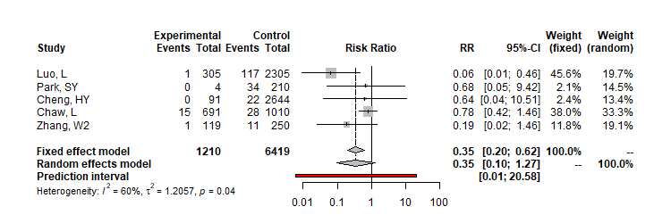
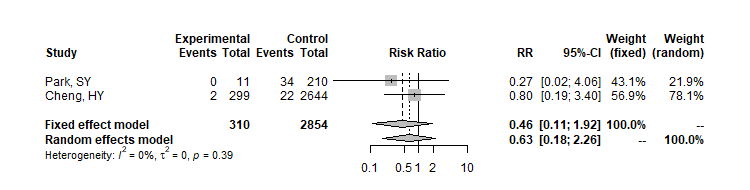

```{r setup, include=FALSE}
knitr::opts_chunk$set(echo = TRUE)

###############################################################
# Question 1: results output                         ##########
# Proportion of asymptomatic cases                   ##########
###############################################################

#load the libraries
library(meta)
library(readxl)
library(tidyverse)
library(httr) 
library(RCurl)
library(dplyr)
library(tidyr)
library(ggplot2)
library(metafor)
library(kableExtra)

# Prepare the data
# get the data directly from redcap:
# report #155 is Q1:
url <- "https://redcap.ispm.unibe.ch/api/"
token <- "F2725F15FE84D2832E2793BB23B0A62B"
formData <- list("token"=token,
                 content='report',
                 format='csv',
                 report_id='155',
                 csvDelimiter='',
                 rawOrLabel='raw',
                 rawOrLabelHeaders='raw',
                 exportCheckboxLabel='false',
                 returnFormat='csv'
)
response <- httr::POST(url, body = formData, encode = "form")
asymptomaticQ1 <- httr::content(response)


settings=c("Contact investigation",
           "Contact investigation, aggregated",
           "Outbreak investigation",
           "Statistical model",
           "Screening",
           "Hospitalised adults",
           "Hospitalised children",
           "Hospitalised adults & children")


asymptomaticQ1$setting2<-factor(asymptomaticQ1$setting2, levels=1:8, labels=settings)

# minor cleaning
asymptomaticQ1[asymptomaticQ1==9999]=NA

asymptomaticQ1$setting=asymptomaticQ1$setting2


data_long1 <- gather(asymptomaticQ1, cluster, total, c(q1_c1_total,q1_c2_total,q1_c3_total), factor_key=TRUE) %>% 
  mutate(id=1:nrow(.)) %>%
  select(record_id, author_1, setting, total, id, cluster)
data_long2 <-gather(asymptomaticQ1, cluster, events, c(q1_c1_event,q1_c2_event,q1_c3_event), factor_key=TRUE) %>% 
  mutate(id=1:nrow(.)) %>%
  select(events, id)

data_Q1 = merge(data_long1, data_long2, by="id")
data_Q1 = data_Q1[!is.na(data_Q1$total),]
data_Q1$cluster=factor(data_Q1$cluster,labels=c("1","2","3"),levels=c("q1_c1_total","q1_c2_total","q1_c3_total"))

data_Q1[data_Q1$record_id %in% asymptomaticQ1[is.na(asymptomaticQ1$q1_c2_event),]$record_id,]$cluster=NA

asymptomaticQ1=data_Q1

asymptomaticQ1$label=paste0("#", asymptomaticQ1$record_id, " ", asymptomaticQ1$author_1, " (2020)",ifelse(!is.na(asymptomaticQ1$cluster),paste0(" cluster:",asymptomaticQ1$cluster),"")) # [FU: ",asymptomaticQ1$fup_median,"]")

asymptomaticQ1$label=paste0("#", asymptomaticQ1$record_id, " ", asymptomaticQ1$author_1,ifelse(!is.na(asymptomaticQ1$cluster),paste0(" [cluster:",asymptomaticQ1$cluster,"]"),"")) # [FU: ",asymptomaticQ1$fup_median,"]")

data=asymptomaticQ1[order(asymptomaticQ1$setting,1/(1/asymptomaticQ1$events+1/(asymptomaticQ1$total-asymptomaticQ1$events))),]

data[is.na(data$setting),]$record_id
data=data[!is.na(data$setting),]

asym_plot<-metaprop(events,total,data=data,sm = "PLOGIT", studlab=label, 
                    byvar=setting,# tau.common =TRUE,
                    control=list(stepadj=0.05, maxiter=10000))#, method ="INV") #, verbose=TRUE, digits=5, control=list(stepadj=0.5))

png(file = 'forest_meta_Q1.png',width=25,height=65, res=600, units="cm") 

forest(asym_plot,  col.square=data$setting,
       #squaresize = 1/(1/data$events+1/(data$total-data$events)),
       #sortvar = 1/(1/events+1/(total-events)), 
       subgroup=TRUE, 
       just.studlab="left", colgap.studlab="2cm",
       #leftcols = c("label", "setting", "age", "design", "asym_denom"),
       #leftcols=c("studlab", "record_id", "event", "n"),
       xlab = "",just="left",comb.random=TRUE,test.subgroup.random=FALSE,
       comb.fixed=FALSE,test.subgroup.fixed=FALSE, predict=T)#, study.results=TRUE,test.subgroup=TRUE)
dev.off()

q1_nstudies <- nrow(asym_plot$data) #total number of studies included in q1
q1_nppl <- prettyNum(sum(asymptomaticQ1$total), big.mark = ",") #total number of people included in q1
q1_nasymp <-  prettyNum(sum(asymptomaticQ1$events), big.mark = ",") #number of people asymptomatic included in q1

###############################################################
# Question 2.1: results output ################################
# Secondary attack rate from asymp or pre-symp cases ##########
###############################################################

# get the data directly from redcap: 
# report #172 is Q2.1 SAR:
url <- "https://redcap.ispm.unibe.ch/api/"
token <- "F2725F15FE84D2832E2793BB23B0A62B"
formData2_1 <- list("token"=token,
                    content='report',
                    format='csv',
                    report_id='172',
                    csvDelimiter='',
                    rawOrLabel='raw',
                    rawOrLabelHeaders='raw',
                    exportCheckboxLabel='false',
                    returnFormat='json'
)
response2_1 <- httr::POST(url, body = formData2_1, encode = "form")
asymptomaticQ2_1 <- httr::content(response2_1)

#clean data
asymptomaticQ2_1[asymptomaticQ2_1=="9999;9999"]=NA #indicate as missing
asymptomaticQ2_1[asymptomaticQ2_1=="9999"]=NA #indicate as missing
asymptomaticQ2_1=asymptomaticQ2_1%>% #separate symp SAR into 2 variables
  separate(q3_sar_s, c("Ec","Nc"), ";", remove=FALSE) 
asymptomaticQ2_1=asymptomaticQ2_1%>% #separate asymp SAR into 2 variables
  separate(q3_sar_a, c("Ee_a","Ne_a"), ";", remove=FALSE) 
asymptomaticQ2_1=asymptomaticQ2_1%>% #separate presymp SAR into 2 variables
  separate(q3_sar_p, c("Ee_p","Ne_p"), ";", remove=FALSE) 

asymptomaticQ2_1=asymptomaticQ2_1 %>% #change values to numeric
  mutate(Ec=as.numeric(Ec),
         Nc=as.numeric(Nc),
         Ee_a=as.numeric(Ee_a),
         Ne_a=as.numeric(Ne_a),
         Ee_p=as.numeric(Ee_p),
         Ne_p=as.numeric(Ne_p))

#metaanalysis for asymptomatic transmission

q2_1_asymp <- metabin(event.e = Ee_a,
                      n.e = Ne_a,
                      event.c = Ec,
                      n.c = Nc, 
                      data = asymptomaticQ2_1[!is.na(asymptomaticQ2_1$Ee_a),],
                      studlab = author_1,
                      prediction = TRUE,
                      sm = "RR",
                      method = "MH",
                      MH.exact = TRUE)
q2_1_asymp

png(file = 'forest_meta_Q2_1_asymp.png',width=750,height=250)

forest(q2_1_asymp)

dev.off()

#metaanalysis for presymptomatic transmission

q2_1_presymp <- metabin(event.e = Ee_p,
                        n.e = Ne_p,
                        event.c = Ec,
                        n.c = Nc, 
                        data = asymptomaticQ2_1[!is.na(asymptomaticQ2_1$Ee_p),],
                        studlab = author_1,
                        prediction = TRUE,
                        sm = "RR",
                        method = "MH",
                        MH.exact = TRUE)

q2_1_presymp


png(file = 'forest_meta_Q2_1_presymp.png',width=750,height=190) 

forest(q2_1_presymp)

dev.off()

###############################################################
# Question 2.2: results output ################################
# Proportion of transmission from asymp or pre-symp ###########
###############################################################


# get the data directly from REDCap: 
# report #157 is Q2.2:

url <- "https://redcap.ispm.unibe.ch/api/"
token <- "F2725F15FE84D2832E2793BB23B0A62B"
formData2_2 <- list("token"=token,
                    content='report',
                    format='csv',
                    report_id='157',
                    csvDelimiter='',
                    rawOrLabel='raw',
                    rawOrLabelHeaders='raw',
                    exportCheckboxLabel='false',
                    returnFormat='csv'
)
response2_2 <- httr::POST(url, body = formData2_2, encode = "form")
asymptomaticQ2_2 <- httr::content(response2_2)

#clean data
asymptomaticQ2_2[asymptomaticQ2_2=="9999;9999"]=NA #indicate as missing
asymptomaticQ2_2[asymptomaticQ2_2 == "9999"] = NA #indicate as missing

#create a separate dataset for the records with >1 result
two_models <- asymptomaticQ2_2
#separate into 2 variables
two_models = two_models %>% 
  separate(q3_pp_m, c("q3_pp_m_1","q3_pp_m_2"), ";")
two_models = two_models %>% 
  separate(q3_pp_l, c("q3_pp_l_1","q3_pp_l_2"), ";") 
two_models = two_models %>%
  separate(q3_pp_u, c("q3_pp_u_1","q3_pp_u_2"), ";")
two_models = two_models %>% 
  separate(q3_setting, c("q3_setting_1","q3_setting_2"), ";") 

two_models <- two_models %>% #change values to numeric
  mutate(q3_pp_m_1=as.numeric(q3_pp_m_1),
         q3_pp_m_2=as.numeric(q3_pp_m_2),
         q3_pp_l_1=as.numeric(q3_pp_l_1),
         q3_pp_l_2=as.numeric(q3_pp_l_2),
         q3_pp_u_1=as.numeric(q3_pp_u_1),
         q3_pp_u_2=as.numeric(q3_pp_u_2))


two_models <- two_models[!is.na(two_models$q3_pp_m_2),]

substrRight <- function(x, n){
  substr(x, nchar(x)-n+1, nchar(x))
}

L1 <- two_models %>%
  pivot_longer(cols = c(6:7),
               names_to = "model",
               values_to = "q3_pp_m") 
L1$label <- paste(L1$author_1, " [", substrRight(L1$model, 1), "]", sep = "")
L2 <- two_models %>%
  pivot_longer(cols = c(8:9),
               names_to = "model",
               values_to = "q3_pp_l") %>%
  select("record_id", "model", "q3_pp_l", "author_1")
L2$label <- paste(L2$author_1, " [", substrRight(L2$model, 1), "]", sep = "")
L2 <- L2 %>% select("q3_pp_l", "label")
L3 <- two_models %>%
  pivot_longer(cols = c(10:11),
               names_to = "model",
               values_to = "q3_pp_u") %>%
  select("record_id", "model", "q3_pp_u", "author_1")
L3$label <- paste(L3$author_1, " [", substrRight(L3$model, 1), "]", sep = "")
L3 <- L3 %>% select("q3_pp_u", "label")
L4 <- two_models %>%
  pivot_longer(cols = c(13:14),
               names_to = "model",
               values_to = "setting") %>%
  select("record_id", "model", "setting", "author_1")
L4$label <- paste(L4$author_1, " [", substrRight(L4$model, 1), "]", sep = "")
L4 <- L4 %>% select("setting", "label")
#merge together
Lall <- merge(L2, L3, by = "label")   
Lall <- merge(Lall, L4, by = "label") 
Lall <- merge(Lall, L1, by = "label")
Lall <- Lall %>%
  select("record_id", "author_1", "q3_pa_m", "q3_pa_l", "q3_pa_u", 
         "q3_pp_m", "q3_pp_l", "q3_pp_u", "question_3_complete", "setting", 
         "label")

#clean original dataset
asymptomaticQ2_2$label <- asymptomaticQ2_2$author_1
asymptomaticQ2_2 <- asymptomaticQ2_2 %>%
  mutate(setting = q3_setting)
asymptomaticQ2_2$q3_setting <- NULL
asymptomaticQ2_2 <- as.data.frame(asymptomaticQ2_2)
attr(asymptomaticQ2_2, 'spec') <- NULL
str(asymptomaticQ2_2)
asymptomaticQ2_2$q3_pp_m <- as.numeric(asymptomaticQ2_2$q3_pp_m)
asymptomaticQ2_2$q3_pp_l <- as.numeric(asymptomaticQ2_2$q3_pp_l)
asymptomaticQ2_2$q3_pp_u <- as.numeric(asymptomaticQ2_2$q3_pp_u)


#add extra rows to original dataset
Q2_2 <- bind_rows(asymptomaticQ2_2, Lall)
#if q3_pp_m and q3_pa_m both NA then delete
Q2_2 <- Q2_2[!is.na(Q2_2$q3_pa_m) | !is.na(Q2_2$q3_pp_m),]

#create new variable for all estimates and indicate asymp/presymp with new variable
#fill Q2_2 first with estimates from q3_pp_m then q3_pa_m
Q2_2 <- Q2_2 %>%
  mutate(estimate = ifelse(!is.na(q3_pp_m),
                           q3_pp_m,
                           q3_pa_m),
         lower_bound = ifelse(!is.na(q3_pp_m),
                                 q3_pp_l,
                                 q3_pa_l),
         upper_bound = ifelse(!is.na(q3_pp_m),
                                 q3_pp_u,
                                 q3_pa_u),
         subgroup = ifelse(!is.na(q3_pp_m),
                           "presymp",
                           "asymp"))
#some records have presymp estimates in estimate now - must make new observation
both <- Q2_2 %>%
  filter(!is.na(Q2_2$q3_pa_m) & !is.na(Q2_2$q3_pp_m)) %>%
  mutate(estimate = q3_pa_m,
         lower_bound = q3_pa_l,
         upper_bound = q3_pa_u,
         subgroup = "asymp")
Q2_2 <- bind_rows(Q2_2, both)
#remove unnecessary cols
Q2_2 <- Q2_2 %>%
  select(c("record_id", "label", "setting", "estimate", "lower_bound", "upper_bound", "subgroup"))
#round numbers to 2 decimal points
Q2_2$estimate <- round(Q2_2$estimate, digits = 2)
Q2_2$lower_bound <- round(Q2_2$lower_bound, digits = 2)
Q2_2$upper_bound <- round(Q2_2$upper_bound, digits = 2)

###############################################################
# forest plot


#prepare data
Q2_2_df <- Q2_2
#create label for proportions
Q2_2_df$prop <- sprintf("%2.2f", Q2_2_df$estimate)
#create label for 95% CIs
Q2_2_df$CI_lower <- sprintf("%2.2f", Q2_2_df$lower_bound)
Q2_2_df$CI_upper <- sprintf("%2.2f", Q2_2_df$upper_bound)
Q2_2_df$CIs <- paste("[", Q2_2_df$CI_lower, #paste together 95% CIs
                     ";", Q2_2_df$CI_upper, "]", 
                     sep = "")
Q2_2_df <- Q2_2_df %>%
  mutate(CI = ifelse(is.na(Q2_2_df$CI_lower), NA, CIs))
Q2_2_df$CI[Q2_2_df$CI == "[NA;NA]"] <- NA
str(Q2_2_df)
#col to indicate headings/studies in plot
Q2_2_df$type <- 2
#new row for asymptomatic label in plot
Asymp_label <- data.frame(NA, "Asymptomatic transmission", NA, NA, NA, NA, NA, 
                          NA, NA, NA, NA, NA, 1)
names(Asymp_label) <- names(Q2_2_df)
#new row for asymptomatic label in plot
Presymp_label <- data.frame(NA, "Presymptomatic transmission", NA, NA, NA, NA, NA, 
                            NA, NA, NA, NA, NA, 1)
names(Presymp_label) <- names(Q2_2_df)
#add to exisiting dataframe
Q2_2_df <- rbind(Q2_2_df, Asymp_label, Presymp_label)
#font indicator
Q2_2_df$fontface = ifelse(Q2_2_df$type == 1, "italic","plain")
str(Q2_2_df$fontface)

#arrange studies by subgroup
asymp_n <- sum(Q2_2_df$subgroup == "asymp", #number of asymp studies
               na.rm = TRUE) 
presymp_n <- sum(Q2_2_df$subgroup == "presymp", #number of presymp studies
                 na.rm = TRUE) 
Q2_2_df$line[Q2_2_df$label == "Asymptomatic transmission"] <- 1
#new row for space in plot
space <- data.frame(NA, NA, NA, NA, NA, NA, NA, NA, NA, NA, NA, NA, NA, NA, NA)
names(space) <- names(Q2_2_df)
#add to exisiting dataframe
Q2_2_df <- rbind(Q2_2_df, space)
Q2_2_df$line[is.na(Q2_2_df$label)] <- 2 + asymp_n
Q2_2_df$line[Q2_2_df$label == "Presymptomatic transmission"] <- 3 + asymp_n
Q2_2_df_a <- Q2_2_df %>% #order the asymp studies
  filter(subgroup == "asymp") %>%
  mutate(line = 2:(asymp_n + 1))
Q2_2_df_p <- Q2_2_df %>% #order the presymp studies
  filter(subgroup == "presymp") %>%
  mutate(line = (asymp_n + 4):(presymp_n + asymp_n + 3))
Q2_2_df <- Q2_2_df[is.na(Q2_2_df$record_id),]
#join all rows again
Q2_2_df <- rbind(Q2_2_df, Q2_2_df_a, Q2_2_df_p)

#create forest plot
p <- ggplot() + 
  geom_point(data = Q2_2_df, #add estimates 
             aes(y = line, 
                 x = estimate),
             fill = "gray", 
             shape = 22, 
             color = "black",
             size = 4) +
  geom_errorbarh(data = Q2_2_df, #add error bars 
                 aes(y = line, 
                     xmin = lower_bound, 
                     xmax = upper_bound), 
                 height=0.3) +
  geom_text(aes(y = c(-1, -1, -1),  #add cols for study, estimates and CIs
                x = c(-0.9, 1.25, 1.75), 
                label=c("Study", "Prop.", "95% CI")), 
            hjust = 0, 
            fontface = "bold") +
  geom_text(data = Q2_2_df, #add estimate labels
            aes(y = line, 
                x = 1.25, 
                label = prop), 
            hjust = 0) +
  geom_text(data = Q2_2_df, #add CI labels
            aes(y = line,
                x = 1.75,
                label = CI), 
            hjust = 0) +
  geom_text(data = Q2_2_df, #add study labels
            aes(y= line, 
                x=-0.9, 
                label = label,
                hjust = 0,
                fontface = fontface)) +
  theme_void() + #remove background
  scale_y_reverse() +
  geom_segment(data = Q2_2_df, #add line below point estimates
               aes(y = max(line) + 1, x = 0, xend = 1, 
                   yend = max(line) + 1)) +
  geom_segment(data = Q2_2_df, #add dash for 0
               aes(y = max(line) + 1, yend = max(line) + 1.3, 
                   x = 0, xend = 0)) +
  geom_segment(data = Q2_2_df, #add dash for 0.25
               aes(y = max(line) + 1, yend = max(line) + 1.3,
                   x = 0.25, xend = 0.25)) +
  geom_segment(data = Q2_2_df, #add dash for 0.5
               aes(y = max(line)+1, yend=max(line) + 1.3,
                   x=0.5, xend=0.5)) +
  geom_segment(data = Q2_2_df, #add dash for 0.75
               aes(y = max(line) + 1, yend = max(line) + 1.3,
                   x=0.75, xend = 0.75)) +
  geom_segment(data = Q2_2_df, #add dash for 1
               aes(y = max(line) + 1, 
                   yend = max(line) + 1.3,
                   x = 1, xend = 1)) +
  geom_text(aes(y = rep(max(Q2_2_df$line) + 2,5), #add numbers to line
                x = 0:4/4, 
                label = c(0.00,0.25,0.5,0.75,1.00)))


p

#create image file
png(file="forest_Q2_2.png", 
    res=300, 
    height=20, width=50, units="cm")
p
dev.off()


```

## Methods   
### Data analysis   
   
   

## Results
### Q1: Proportion of asymptomatic cases

We included `r q1_nstudies` studies that reported empirical data about `r q1_nppl` people with SARS-CoV-2 infection (`r q1_nasymp` defined as having asymptomatic infection).


   
   
### Q2.1: Secondary attack rate from asymptomatic and presymptomatic cases






### Q2.2: Proportion of transmission from asymptomatic or pre-symptomatic infections

